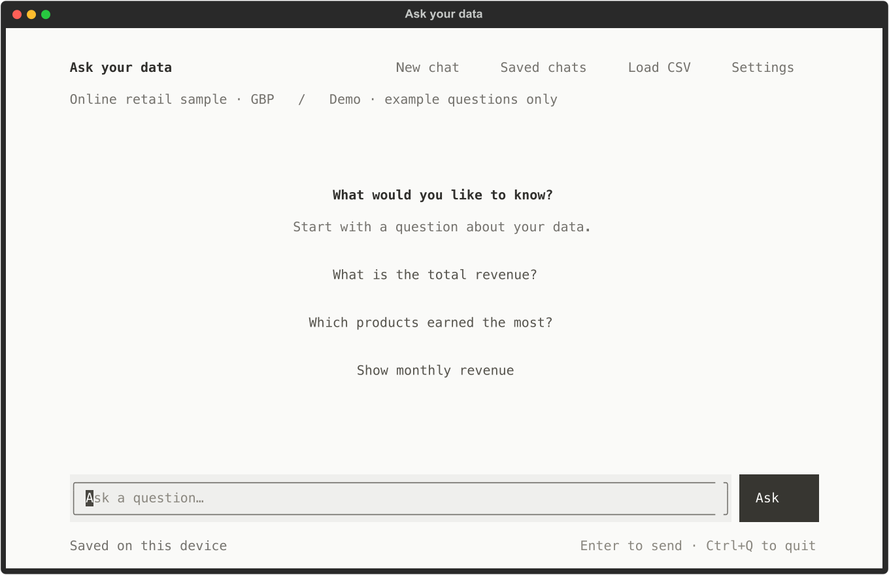

# Ask Your Data

A local **terminal chatbot** for exploring sales data with visible SQL and query results.
Built with Python, Textual, SQLite, SQLGlot, and an optional OpenAI Agents SDK connection.

**Status: local app with AI setup and saved data definitions.** The offline demo, saved chats, CSV imports, checked
SQL execution, and on-demand answer details work locally. The AI integration is implemented and
mock-tested; an authenticated live model call has **not** been verified. Offline mode
supports a small explicit set of questions; it is not a general-purpose AI chatbot.

## Run it on this computer

A Python 3.12 virtual environment is already prepared in this checkout:

```bash
.venv/bin/python app.py
```

Or double-click `Start Chatbot.command` in Finder. No API key is needed for offline mode.
The app adapts to a standard 80×24 terminal. A 120×40 window gives more room for results.

For a fresh checkout, use Python 3.11 or newer (tested on Python 3.12):

```bash
python3.12 -m venv .venv
source .venv/bin/activate
python -m pip install -r requirements.txt
python app.py
```



The main screen keeps the conversation and question box in focus. Saved chats, CSV
imports and answer details open separately. Click an example to put it in the question
box, then press Enter or Ask. Press Escape to close a dialog.

## Try it

Ask one of these supported offline questions:

- What is the total revenue?
- Show monthly revenue
- Which five products generated the most revenue?
- Show revenue by country
- How many orders are there?

The sample's net invoiced revenue is **£117,058.55**, computed from 6,224 lines across
390 invoices. This is a deliberately selected sample, not full-retailer revenue.

| Action | How |
| --- | --- |
| Start another chat | New chat button, Ctrl+N, or `/new` |
| Load your own CSV | Load CSV button, Ctrl+O, or `/load`; preview and confirm |
| Reopen a chat | Open Saved chats and choose a conversation |
| Inspect an older answer | View answer details, then choose the question |
| See executed SQL / definitions | View answer details → SQL / Definitions |
| Inspect columns used by an answer | View answer details → Columns |
| Save CSV column meanings | Settings → Data definitions |
| Connect a model | Settings → AI connection |
| Restore bundled data | `/sample` |
| Query a CSV offline | `show data` or `how many rows` |
| Run read-only SQL directly | `/sql SELECT * FROM records LIMIT 10` |
| Show examples | `/help` |
| Exit | Ctrl+Q |

Ctrl+Q also exits while a dialog is open. When using VS Code, keep the terminal
focused; the included workspace setting passes its macOS Ctrl+Q shortcut through
to the chatbot instead of opening VS Code's view picker.

Answers and evidence are saved automatically. Each chat has one active dataset.
Replacing it keeps earlier answers labelled with their original dataset; those answers
are excluded from the new dataset's model context. Open View answer details and choose an older question to inspect
its original result table and SQL. The full history remains on disk.

## Real public sales data

The bundled dataset is derived from [UCI Online Retail](https://archive.ics.uci.edu/dataset/352/online-retail),
Daqing Chen (2015), [DOI 10.24432/C5BW33](https://doi.org/10.24432/C5BW33),
licensed [CC BY 4.0](https://creativecommons.org/licenses/by/4.0/).

The sample retains the first 25 ordinary and 5 cancellation invoices per month, with all
of their lines, in original workbook order. It spans December 2010–December 2011.
It includes missing customer IDs, credits and varying invoice-line timestamps. The app
uses related customers, products, orders and order_items tables. Net invoiced value is
signed quantity × unit price in GBP, with negative prices excluded and credits retained.
See [sample provenance](data/sample/README.md), [manifest](data/sample/manifest.json),
[data dictionary](data/knowledge/data_dictionary.md), and [business rules](data/knowledge/business_rules.md).

## Optional AI mode

Open **Settings → AI connection**. Enter your API key in the hidden field and an exact
API model ID, then click **Test connection**. This makes a live API request with a
disposable two-row database (20 + 22), verifies the SQL tool returned 42, and enables
**Use AI** only if that check passes. The test uses API credits and sends no personal
CSV data. A successful test verifies connectivity/tool wiring, not general answer accuracy.

Keys entered in the app stay in memory for this session; they are never written to chat
history or a configuration file. After restarting, enter the key again or configure your
local `.env` as described below. **Use demo** switches back without another model call.


The selected integration is the [OpenAI Agents SDK](https://developers.openai.com/api/docs/guides/agents/sdk).
It exposes dataset-scoped schema, definitions and checked-query tools to one agent.
No LangGraph, PostgreSQL, Streamlit, cloud hosting, or vector database is required.

```bash
.venv/bin/python -m pip install -r requirements-agent.txt
cp .env.example .env
```

Edit `.env` locally with `OPENAI_API_KEY` and an exact `OPENAI_MODEL` available to your
API account. [GPT-6 Luna is documented as `gpt-6-luna`](https://developers.openai.com/api/docs/models/gpt-6-luna);
account access and a live tool round-trip still need verification. No model is silently
selected or substituted. Launch explicitly:

```bash
.venv/bin/python app.py --ai
```

AI mode sends questions, limited recent context, schema/definitions and bounded query
results to the configured OpenAI API. It may incur API charges; this application does
not use Codex sign-in. Trace export is disabled. Keys remain in the ignored `.env` file.
CSV import, saved definitions and offline questions make no model calls. `/sql` always runs locally.

Without credentials, the app explains the missing setup. General natural-language
questions and follow-ups are only supported through the AI route and are not yet
live-evaluated. Offline mode will say when a question is unsupported.

## CSV support and local storage

Load one UTF-8, comma-separated CSV at a time: up to 5 MB, 50,000 rows, 100 columns,
and 10,000 characters per cell. The import rejects duplicate headers, invalid row widths,
and invalid encoding. It previews column types and blank counts before activation.
Leading-zero identifiers remain text; blank cells become SQL NULL. Dates remain text.
The active table for custom CSVs is `records`; use quoted column identifiers where needed.

Column meanings and currencies are not guessed. Use **Settings → Data definitions** to save what columns mean, which currency they use,
and any calculation rules (up to 8,000 characters). The model receives these definitions
with each new question; it should still ask about anything unclear. Definitions are
versioned per dataset and survive restarts. Editing them resets the recent model context
for chats using that dataset; old answers retain their original definition snapshots.
The bundled sample definitions are read-only.
The original source file can be moved afterward: a snapshot is stored locally.

Private files live under `data/private/`: metadata, chats, original CSV copies and per-dataset
SQLite files. They are ignored by Git, as are `.env`, virtual environments and private
planning PDFs. There is no automatic cloud backup. `--home /path/to/folder` selects
another local storage directory.

A terminal connection check is also available:

```bash
.venv/bin/python app.py --check-ai
```

It reads the local `.env`, uses disposable test data, and returns a nonzero exit status
on missing credentials or an unverified result. It never creates a normal saved chat.

## Verification

```bash
.venv/bin/python -m pip install -r requirements-dev.txt
.venv/bin/python -m pytest -q
.venv/bin/python -m evaluation.evaluate
```

Current local result: **60 tests passed; 12/12 offline evaluation cases passed.**

The tests exercise allowed queries, rejected writes/attachments/functions, SQLite
read-only enforcement, output caps, timeouts, CSV validation, persistence and isolation,
SDK tool wiring with a mocked runner, source-data reconciliation, and headless terminal
interactions. The offline evaluation has 12 verified regression cases; reference totals
come from independent Python Decimal calculations over the CSV, not the application's SQL.
Evaluation writes an ignored report to `evaluation/results/offline.json`.

These checks measure local code and deterministic demo behaviour, **not live-model
answer accuracy**. A successful SQL query is not proof of correct interpretation.

For a scriptable smoke check:

```bash
.venv/bin/python app.py --ask 'What is the total revenue?'
# Reuse the printed chat ID on subsequent runs:
.venv/bin/python app.py --chat CHAT_ID --ask 'Show monthly revenue'
```

## Next milestones

- Verify an authenticated Luna/tool round-trip and record token usage and API cost.
- Expand held-out natural-language evaluations, including follow-ups and filter retention.
- Compare small-schema context against retrieval before introducing embeddings/reranking.

See [architecture and boundaries](docs/architecture.md). No software licence has been added.
